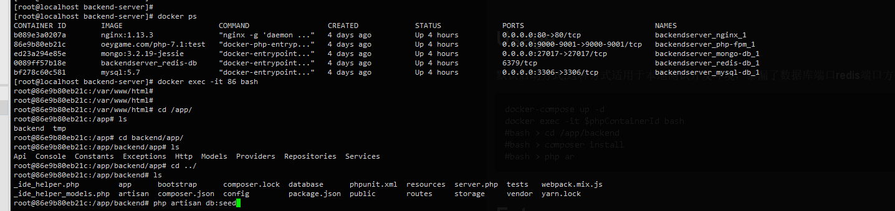

## Overview 
客户端项目请查看：
https://github.com/zhaojunlike/vue-scrum-task-client

### Containers
-   1.nginx
-   2.mysql-db
-   3.redis-db
-   4.php-fpm
-   5.composer
-   6.mongo-db
-   7.visualizer

其中不需要的镜像可以注释掉

## QuickStart


### Install Docker
安装Docker Ce
```bash
$bash ./app/tools/docker-installer.sh
```
### Install docker-compose
```bash
$cp ./docker-compose /usr/local/bin/
$chmod +x /usr/lcoal/bin/docker-compose
```
## Usage

默认启动方式,这种方式适用于本地测试开发环境，暴漏了数据库端口redis端口方便调试
1.docker-compose up --build

```bash
docker-compose up -d
docker exec -it $phpContainerId bash 
#bash > cd /app/backend
#bash > composer install
#bash > php artisan db:seed
```



## Future


